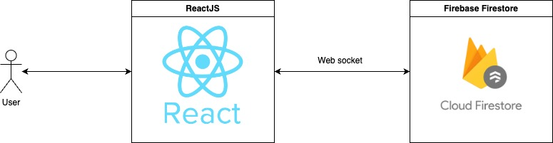
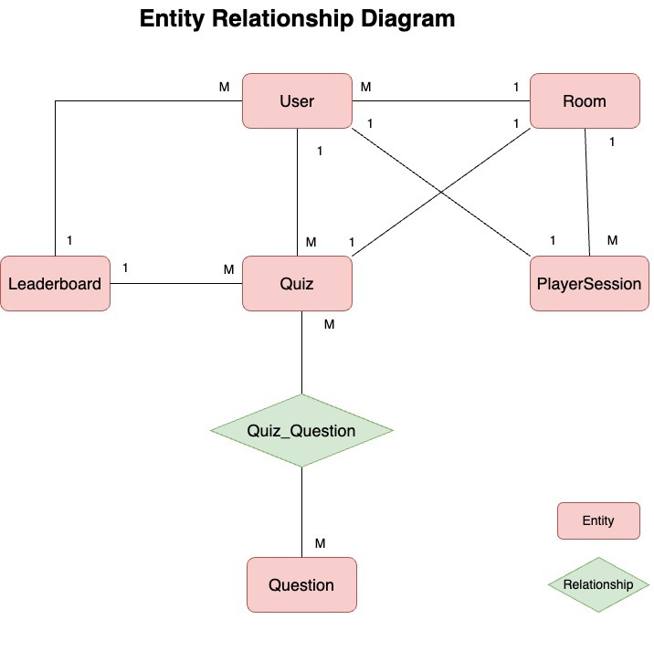
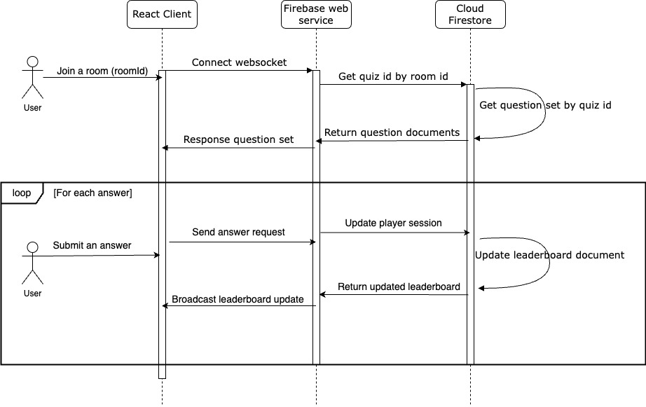
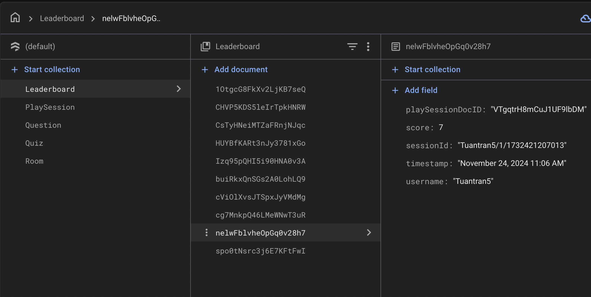

<!-- PROJECT LOGO -->
 

  

<h3 align="center">Real-Time Vocabulary Quiz</h3>

  

    Multiplayer real-time quiz web application 
  

<!-- GETTING STARTED -->
## Introduction
### Description
* Developing a real-time quiz feature for an English learning application
* A personal project for applying at Elsa

### Techniques

* Data Modeling
* Database Design
* Serverless architecture
* Codebase: Principles, Design Patterns
* Implementing cloud service
* Cloud realtime noSQL database
* Unit Testing
* Deployment

### Tech stack

* Programming Language: Javascript
* Framework: React 18
* Database: Firebase firestore
* Unit Testing: Jest
* CI/CD: Github Actions
* Deployment: AWS Elastic Beanstalk

## Requirements specification
This document outlines the architecture, component interactions, data flow, and technology choices for a quiz application with real-time leaderboard updates. The system enables users to participate in quizzes, submit answers, and see updated leaderboards based on their performance.
### Architecture diagram

Take advantage of cloud noSQL database service and serverless
architecture, the project was built in lighting fast speed and easy to deploy.
- The frontend web application was built with React, a popular framework for single page application with reusable components.
- The backend was serverless taking advantage of Google cloud infrastructure. Firebase firestore is a great real time cloud storage service with pub-sub mechanism. We could listen to every change on database record through websocket protocol.
### ER diagram

We have 4 main entities including the user or player, quiz, room and leaderboard.
- Each user have unique player session contain their number of questions and answers, timestamp, their current score
storage in database as a document. Every time anyone submits an answer, we could listen to any change in the corresponding document to update that state in front end.
- We have many rooms, each room contains many user ids and unique quiz id. Each quiz contains different set of questions that means each room plays different quiz game with different player.
- The leaderboard is updated every time someone submits an answer. When a player open a new game, the system created a new record on the database with score zero. Front end displays and updates the leaderboard in realtime.

### Data flow diagram

- User join a room by typing room id, each room have corresponding quiz id.
- The front end send a request to firebase, a websocket connection established.
- The firebase web service return question set matching with quiz in player room.
- When user submit a question, player session document update the question counter. If the answer is correct, leaderboard document is also updated.
- Client listen to any change in player session and leaderboard document and display leaderboard to the UI.

## Implementation
As a startup with limited resources, we need a solution that solve technical problems with minimal cost. So, why "reinventing the wheel" when we have a lot of services that help us build amazing web application with minimal technical task and cost.

This application backend was serverless, which mean we have no coding task for server-side. Firebase is a service built on Google infrastructure. It's highly scalability and reliability with build in load balancer, great performance and no worry about maintainability. This solution saves a lot of time for developing web app.

We would focus on the leaderboard function. The leaderboard stored in firebase as document with following structure:

Each leaderboard document have username and their score for display in a table. Other information includes timestamp for sorting player ranking when they have same score, sessionId to know which room and quiz they had completed, they are scalability and useful to build another functions like display player history, win rate.

